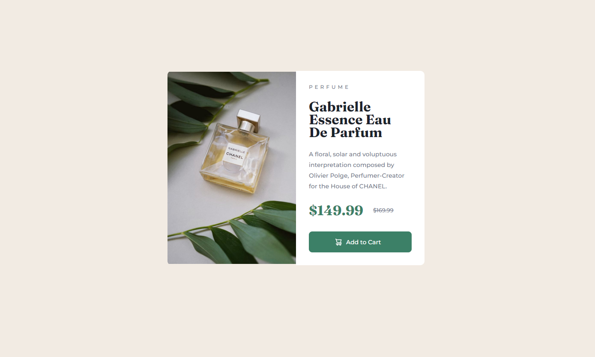

# Frontend Mentor - Product preview card component solution

This is a solution to the [Product preview card component challenge on Frontend Mentor](https://www.frontendmentor.io/challenges/product-preview-card-component-GO7UmttRfa). Frontend Mentor challenges help you improve your coding skills by building realistic projects. 

## Table of contents

- [Overview](#overview)
  - [Screenshot](#screenshot)
  - [Links](#links)
- [My process](#my-process)
  - [Built with](#built-with)
  - [What I learned](#what-i-learned)
- [Author](#author)

## Overview

### Screenshot

### Links

- Solution URL: [Add solution URL here]()
- Live Site URL: [Add live site URL here]()

## My process

### Built with

- HTML5 markup
- CSS3
- Flexbox
- CSS Grid

### What I learned

I learned many things on this project that will help me with future projects. I learned how to align the cart icon and text within the button. I also got to enhance my knowledge of media queries. 

## Author

- Website - [Tom Cieslukowski](https://www.tomcieslukowski.com/)
- Frontend Mentor - [@ciesluk](https://www.frontendmentor.io/profile/ciesluk)
- Twitter - [@ciesluk_codes](https://www.instagram.com/ciesluk_codes/)
